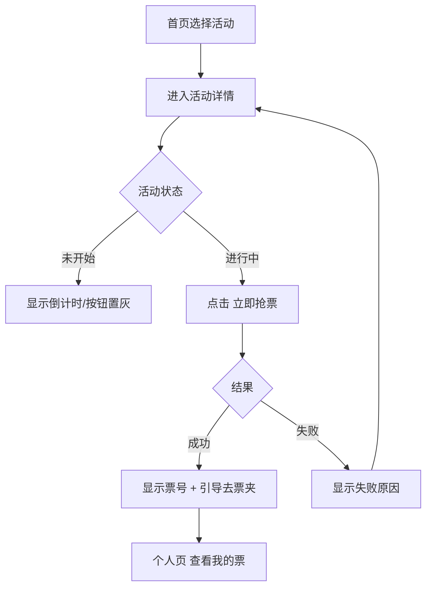
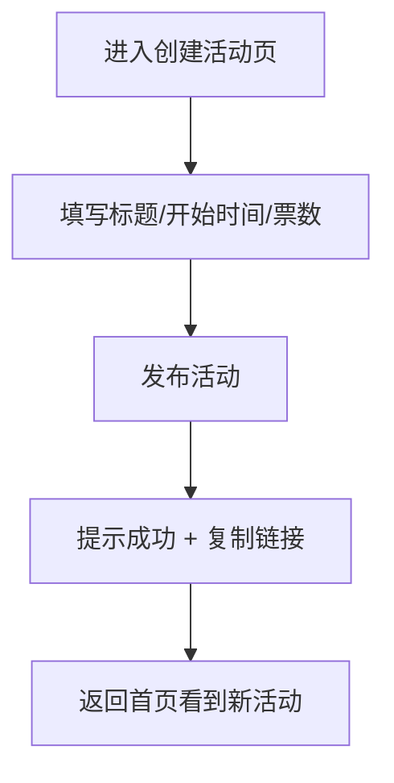

# PRD｜抢票裁定引擎 MVP（Ticket Allocation Engine）V1.0

---

## 0. 文档信息

- **目的**：形成团队对 MVP 产品模型、页面功能、用户流程、规则与验收标准的唯一共识，支撑开发与现场演示。
- **范围**：Hackathon MVP（3 页）
- **读者**：产品/设计/前端/演示负责人
- **版本**：V1.0

---

## 1. 一句话定义

**抢票裁定引擎**是一个面向“多人同时争抢稀缺名额”的 MVP 产品：用户在活动详情页参与抢票，系统即时给出成功/失败并展示剩余票数；主办方可创建抢票活动；用户可在个人页查看票夹与参与记录。

---

## 2. 背景与问题

### 2.1 场景事实

抢票/名额申领类活动常见特征：

- 同一时刻大量人参与
- 名额稀缺，大部分人必然失败
- 参与者关注“是否公平”“结果是否清晰”
- 主办方关注“活动是否顺利售罄”“争议是否可控”

### 2.2 核心问题

- **参与者**：如何在一次操作后得到明确结果，并看到活动实时状态（剩余票数、是否售罄）？
- **主办方**：如何以最少配置发布活动，并实时观察抢票进度与成功名单？
- **旁观者/评委**：如何直观看到高并发下的“状态快速变化 + 结果清晰”？

---

## 3. 产品目标与非目标

### 3.1 MVP 目标（必须达成）

G1. 首页展示可参与活动列表，信息足够用户决策（状态/倒计时/剩余票数/入口）
G2. 活动详情展示实时状态，并提供“参与抢票”动作与明确结果提示
G3. 主办方可创建活动（标题/开始时间/票数）并发布
G4. 个人页支持连接身份、查看我的票夹、查看参与记录
G5. 活动过程可视化：剩余票数变化 + 最近成功记录（增强可信与观感）

### 3.2 非目标（明确不做）

NG1. 不做完整票务体系（支付、退款、客服、合规）
NG2. 不做线下验票/实名核验
NG3. 不做多种售票机制（拍卖/抽签等）
NG4. 不承诺彻底防黄牛/脚本（仅做“限购”等轻量规则表达）

---

## 4. 产品模型（Objects & Roles）

### 4.1 角色

- **参与者 Participant**：浏览活动并参与抢票
- **主办方 Organizer**：创建并发布活动
- **旁观者 Observer**：查看状态与结果（演示/评委）

### 4.2 核心对象

- **活动 Event**
    - 字段：标题、开始时间、总票数、剩余票数、状态（未开始/进行中/已售罄）
- **票 Ticket**
    - 字段：所属活动、票号、归属（某参与者）
- **参与记录 Attempt**
    - 字段：参与者、活动、时间、结果（成功/失败）、失败原因（枚举）

---

## 5. 信息架构（3 页 MVP）

1. **首页｜活动广场**：活动列表 → 进入活动详情 → 参与抢票
2. **创建活动页**：创建并发布活动 → 回到首页可见
3. **个人页（我）**：连接身份 + 我的票夹 + 我的参与记录

> 活动详情为“首页的二级视图（子页/弹层）”，不单独算新页。
> 

---

## 6. 用户故事（强约束）

**US-1（参与者）**：我希望在活动开始后点击一次“抢票”就能得到明确结果（成功/失败），而不是卡住或不确定。
**US-2（参与者）**：我希望看到活动实时状态（倒计时、剩余票数、是否售罄），以便决定是否参与。
**US-3（主办方）**：我希望用最少信息发布活动，并实时看到售出进度，必要时能复制活动链接给用户。
**US-4（旁观者/评委）**：我希望看到票数快速下降直至售罄、成功记录持续产生，证明这是一个“并发抢占”的真实演示。

---

## 7. 关键规则（MVP 固定，避免分歧）

### 7.1 活动状态（仅允许三种）

- **未开始**：开始时间未到，展示倒计时，禁止参与
- **进行中**：允许参与
- **已售罄**：剩余票数为 0，禁止参与

### 7.2 售票规则（V1 固定）

- **先到先得**
- **限购：每个参与者最多成功 1 张**（默认启用）

### 7.3 失败原因（必须可读、枚举化）

- 已售罄
- 已达到限购（已成功过）
- 未抢到（名额已被抢完/未成功）

---

## 8. 用户流程（Mermaid）

### 8.1 全局页面流转

### 8.2 参与者抢票流程

### 8.3 主办方创建活动流程

---

# 9. 页面级需求（核心：读完能脑补 UI）

## Page 1：首页｜活动广场（P0）

### 9.1 页面目标

- 展示可参与活动
- 活动信息足够判断是否进入
- 快速入口：创建活动 / 个人页

### 9.2 页面结构（从上到下）

1. 顶部导航栏
2. 活动列表（卡片）
3. 空态（无活动）

### 9.3 顶部导航栏

- 左侧：产品名/Logo（点击回首页）
- 右侧按钮：
    - `创建活动`
    - `我`

### 9.4 活动卡片（列表项）— 必须字段

- 活动标题
- 开始时间（绝对时间）
- 倒计时（仅未开始展示）
- 状态标签：未开始 / 进行中 / 已售罄
- 票数概览：剩余 / 总数（例如 `12 / 50`）
- 主按钮（随状态变化）：
    - 未开始：`查看详情`
    - 进行中：`去抢票`
    - 已售罄：`查看结果`

### 9.5 空态

- 文案：`暂无活动`
- 引导按钮：`创建一个活动`（跳转创建页）

---

## Page 1 子视图：活动详情｜实时状态 + 抢票（P0）

> 从首页卡片进入，属于首页体系内的二级视图（子页/弹层）。
> 

### 9.6 页面目标

- 让用户一眼看懂当前状态
- 清晰展示规则与限制
- 一键参与并获得明确结果

### 9.7 页面结构

1. 顶部：返回 + 活动标题
2. 状态面板（大数字）
3. 规则卡片（3 行）
4. 抢票操作区（按钮 + 结果）
5. 实时动态（最近成功记录，可选但建议）
6. 底部说明（1-2 行）

### 9.8 状态面板（大数字）

- 状态：未开始/进行中/已售罄
- 剩余票数（大号）
- 总票数
- 未开始时展示倒计时

### 9.9 规则卡片（固定文案，避免争议）

- `规则：先到先得`
- `限购：每个参与者最多 1 张`
- `结束：售罄自动结束`

### 9.10 抢票操作区

**按钮状态**

- 未开始：按钮置灰 `未开始`
- 进行中：主按钮 `立即抢票`
- 已售罄：按钮置灰 `已售罄`

**结果区（点击后出现，必须可读）**

- 成功：
    - 标题：`🎉 抢票成功`
    - 内容：`你获得票号 #XXX`
    - CTA：`去我的票夹`
- 失败：
    - 标题：`😥 抢票失败`
    - 原因：从失败原因枚举中取
    - CTA：`返回活动状态`（关闭结果提示即可）

### 9.11 实时动态（建议 P0）

- 标题：`最新抢到的用户`
- 每条：匿名短标识 + 票号（可选）+ “刚刚/xx秒前”
- 目的：增强“进行中”的可见性与演示效果

### 9.12 底部说明（固定两行）

- `本活动将按公开规则执行，结果以系统裁定为准。`
- `V1 不提供实名核验，不保证现实意义的一人一票。`

---

## Page 2：创建活动页（P0）

### 9.13 页面目标

主办方快速创建活动并发布，发布后可复制链接并回到首页。

### 9.14 页面结构

1. 顶部：返回 + 标题
2. 表单区
3. 发布按钮
4. 成功提示

### 9.15 表单字段（MVP 最小集）

**必填**

- 活动标题（输入框）
- 开始时间（日期时间选择）
- 总票数（整数）

**固定展示（不可编辑）**

- 规则：先到先得
- 限购：每个参与者最多 1 张

**按钮**

- `发布活动`（主按钮）

### 9.16 成功提示（发布后）

- Toast：`发布成功`
- 显示：活动链接（可复制按钮）
- CTA：`返回首页`

---

## Page 3：个人页｜我（P0）

### 9.17 页面目标

连接身份、查看我的票夹、查看我的参与记录，形成闭环。

### 9.18 页面结构

1. 顶部身份区（连接状态）
2. Tab：`我的票夹` / `我的参与记录`
3. 列表区
4. 空态引导

### 9.19 顶部身份区

- 未连接：按钮 `连接钱包`
- 已连接：
    - 地址短显示（例如 `0x12ab…89cd`）
    - 按钮：`断开/切换`（可选）

### 9.20 我的票夹（默认 Tab）

票卡字段：

- 活动标题
- 票号
- 获取时间（可选）
- CTA：`查看活动`（跳转活动详情）

空态：

- 文案：`你还没有票`
- CTA：`去首页看看活动`

### 9.21 我的参与记录（第二 Tab）

记录字段：

- 活动标题
- 参与时间
- 结果：成功/失败
- 失败原因（若失败）

---

## 10. 关键文案规范（防误解）

- 状态标签只用：`未开始/进行中/已售罄`
- 失败原因必须是人话，不允许“未知错误”
- 抢票按钮在未开始/售罄时必须明确不可用

---

## 11. 验收标准（Acceptance Criteria）

**首页**

- AC-1 能看到活动卡片列表，卡片包含：标题、开始时间、状态、剩余/总票数、CTA
- AC-2 活动状态变化后，卡片状态与 CTA 同步变化

**活动详情**

- AC-3 未开始显示倒计时且按钮置灰
- AC-4 进行中可点击抢票且能得到成功/失败明确结果
- AC-5 售罄后按钮置灰，且显示“已售罄”
- AC-6 成功后能在个人页票夹中看到该票

**创建活动**

- AC-7 可创建活动（标题/开始时间/票数）并在首页出现
- AC-8 发布成功后可复制活动链接

**个人页**

- AC-9 连接状态可见
- AC-10 票夹与参与记录可查看，空态有引导

---

## 12. 主要风险（产品层）

- R1：被理解成“完整票务平台” → 通过非目标与页面文案强调“裁定 MVP”
- R2：用户对公平的预期不一致 → 明确“规则公平”，在详情页底部写清楚
- R3：页面信息不足导致误解 → 强制规则卡片、失败原因枚举、状态面板大数字

---

## 13. MVP 交付清单（现场演示可用）

- 首页活动列表 + 活动详情（含实时状态与抢票结果）
- 创建活动页（发布后回首页可见）
- 个人页（连接身份 + 票夹 + 记录）
- 统一文案与状态枚举